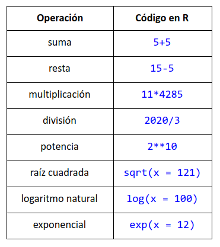

# Introducción 

## Instalación

[R](https://cran.itam.mx/index.html)

[RStudio](https://rstudio.com/)


**R** es un lenguage de programación que tiene un enfoque de análisis estadístico

**R** es el lenguaje de programación y **R Studio** es el IDE

```r
print('Hola mundo en R')
```

Se pueden usar comillas dobles o simples

### R como calculadora



### Representación de numeros en R

Cuando se escriben números R los cambia a notación e

```r
10000000
[1] 1e+07
0.0000001
[1] 1e-07
```
1e+07 es igual a 1 x 10 a la 7

La notación e dice que cualquier número a puede ser expresado como **aey** que representa **a x 10y**

R tiene un límite de representación de números

### Orden de Operaciones

**+** 
  - Paréntesis
  - Exponentes
  - Multiplicación
  - División
  - Suma 
  - Resta

**-**


