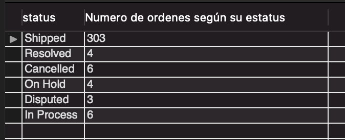
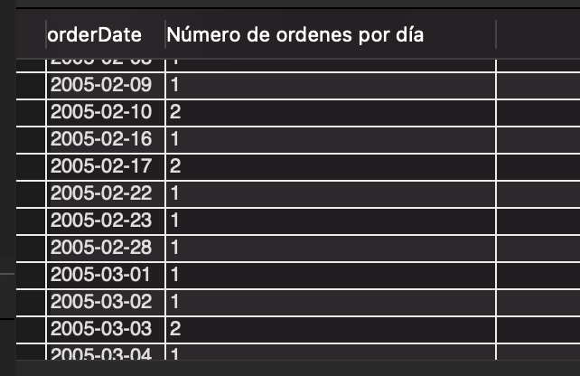
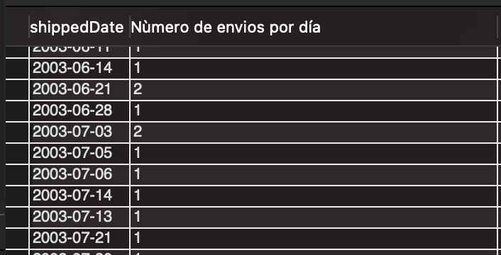

## Pattern Matching

- case-insensitive

```sql
SELECT contactFirstName FROM customers WHERE contactFirstName LIKE 's%';
```
```sql
SELECT contactFirstName FROM customers WHERE contactFirstName NOT LIKE '%e';
```
```sql
SELECT contactFirstName FROM customers WHERE contactFirstName LIKE '%sU%';
```
```sql
SELECT contactFirstName FROM customers WHERE contactFirstName LIKE 'S_';
SELECT contactFirstName FROM customers WHERE contactFirstName LIKE '_____';
```

## Functions

[MySQL functions](https://www.techonthenet.com/mysql/functions/)

```sql
SELECT * FROM payments; 
```
```sql
SELECT sum(amount) AS 'pagos totales' FROM payments;
```
```sql
SELECT sum(amount) AS 'suma de los salarios más altos' FROM payments WHERE amount > 100000;
```
```sql
SELECT count(checkNumber) AS 'numero de cheques' FROM payments;
```
```sql
SELECT max(amount) AS 'salario más alto' FROM payments;
```
```sql
SELECT min(amount) AS 'salario más bajo' FROM payments;
```
```sql
SELECT avg(amount) AS 'promedio de los salarios' FROM payments;
```
```sql
SELECT avg(amount) AS 'promedio salarios más altos' FROM payments WHERE amount > 100000;
```

# Grouping

```sql
SELECT status, count(*) "Numero de ordenes según su estatus" FROM orders GROUP BY status;
```



```sql
SELECT orderDate, count(*) 'Número de ordenes por día' FROM orders GROUP BY orderDate;
```


```sql
SELECT shippedDate, count(*) 'Nùmero de envios por día' FROM orders GROUP BY shippedDate;
```


## Subquery

### Subquery escalonada

Exercise:

A query that obtains the productName and productLine of the produts which price is more than the average

1. Which is the average?
```sql
SELECT avg(MSRP) AS 'media de precio' FROM products;
```

2. Obtain the products depending on the average

```sql
SELECT productName, productLine FROM products WHERE MSRP > (SELECT avg(MSRP) FROM products);
```
