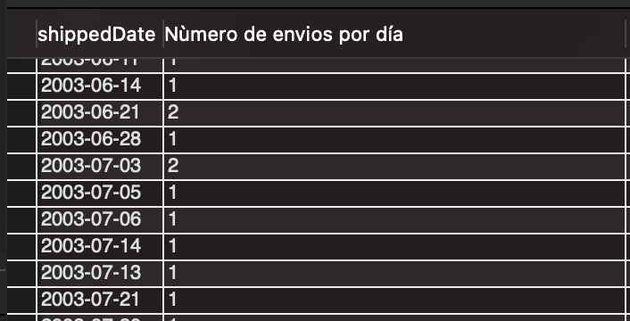

## Pattern Matching

- case-insensitive

```sql
SELECT contactFirstName FROM customers WHERE contactFirstName LIKE 's%';
```

```sql
SELECT contactFirstName FROM customers WHERE contactFirstName LIKE '%sU%';
```
```sql
SELECT contactFirstName FROM customers WHERE contactFirstName LIKE 'S_';
SELECT contactFirstName FROM customers WHERE contactFirstName LIKE '_____';
```

## Functions

Grouping functions make arithmetic operations within a column and return a single value.
  
[MySQL functions](https://www.techonthenet.com/mysql/functions/)

```sql
SELECT * FROM payments; 
```
```sql
SELECT sum(amount) AS 'pagos totales' FROM payments;
```
```sql
SELECT sum(amount) AS 'suma de los salarios más altos' FROM payments WHERE amount > 100000;
```
```sql
SELECT count(checkNumber) AS 'numero de cheques' FROM payments;
```
```sql
SELECT max(amount) AS 'salario más alto' FROM payments;
```
```sql
SELECT min(amount) AS 'salario más bajo' FROM payments;
```
```sql
SELECT avg(amount) AS 'promedio de los salarios' FROM payments;
```
```sql
SELECT avg(amount) AS 'promedio salarios más altos' FROM payments WHERE amount > 100000;
```

# Grouping

```sql
SELECT status, count(*) "Numero de ordenes según su estatus" FROM orders GROUP BY status;
```


```sql
SELECT orderDate, count(*) 'Número de ordenes por día' FROM orders GROUP BY orderDate;
```


```sql
SELECT shippedDate, count(*) 'Nùmero de envios por día' FROM orders GROUP BY shippedDate;
```


## Subquery

A subquery is a query inside a query, they may appear on tha clause WHERE, FROM and SELECT

Examples:
**WHERE**
1. Get the employees which position is 'Junior Executive'
```sql
SELECT * FROM empleado;
# From this query we only obtain the id of the position and the employee information 
```
```sql
SELECT * FROM puesto;
# From this query we obtain de id and the name 
```
```sql
SELECT id_puesto FROM puesto WHERE nombre = 'Junior Executive';
```
Now once we have the id of the position it is possibly to make the asked query.
```sql
SELECT * FROM empleado WHERE id_puesto IN
  (SELECT id_puesto FROM puesto WHERE nombre = 'Junior Executive');
```

**FROM**
1. Obtain the sales average of each article

```sql
SELECT id_articulo, COUNT(*) AS ventas FROM tienda.venta GROUP BY id_articulo;
# Get the number of sales by article
```

```sql
SELECT AVG(ventas) AS ventas_promedio_por_articulo
FROM
   (SELECT
   id_articulo,
   COUNT(*) AS ventas
   FROM tienda.venta
   GROUP BY id_articulo) AS numero_de_ventas;
```

**SELECT**
1. Obtain the salary of each epmloyee
```sql
SELECT nombre, apellido_paterno, (SELECT salario FROM puesto WHERE id_puesto = e.id_puesto) AS sueldo
FROM empleado AS e;	
```

### Subquery escalonada
Exercise:

A query that obtains the productName and productLine of the produts which price is more than the average

1. Which is the average?
```sql
SELECT avg(MSRP) AS 'media de precio' FROM products;
```

2. Obtain the products depending on the average

```sql
SELECT productName, productLine FROM products WHERE MSRP > (SELECT avg(MSRP) FROM products);
```

