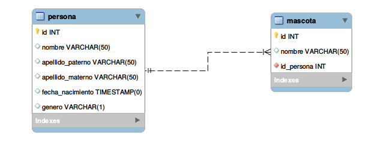
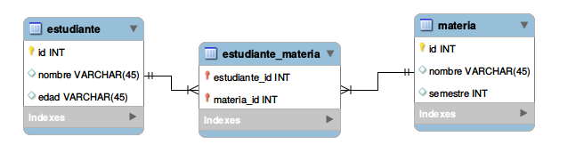
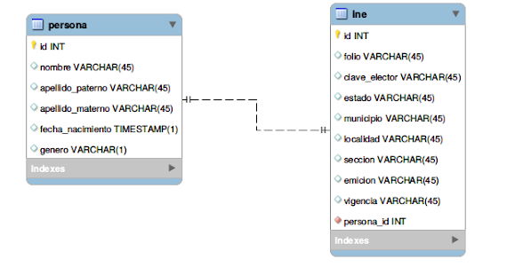

# Joins y Vistas

## Llaves primarias y llaves foráneas

**Llave primaria** Identifica de manera única cada uno de los registros de una tabla, es un campo que no se repite pero es usual un camponadicinal a cada registro que se llama identificador de tipo entero, un identificador que incrementa en uno cada que hay un nuevo registro.

**Llaves foráneas** representan la relación que pudiera haber en dos tablas. Cuando una tabla , almacena la llave primaria de otra tabla, llamamos a ésta llave foránea. E.g. tabla de mascotas, una mascota un dueño vs varias mascotas un mismo dueño.

Una tabla puede tener varios campos como llaves primarias.

## Tipos de relaciones 

1. 1:N



2. N:N

Este tipo de relación permite unir dos tablas que en un principio no tienen relación directa.



3. 1:1 Esta relación indica que ninguna tabla puede repetir registros de otra



## JOINS

Tres tipos:

- Inner Join
- Left Outer Join
- Right Outer Join

**Inner Join**

e.g. Obtén todos los campos de la tabla persona, todos los campos de la tabla mascota y muestra solo los registros donde el id de la persona sea igual al id de la persona asociada a la mascota

```sql
SELECT * FROM persona JOIN mascota ON persona.id = mascota.id_pesona;
```

**Left Join**

Trae todos los registros de la tabla izquierda y únicamente aquellos registros que cumplan con la condición de la relación de la otra tabla.

e.g. Obtén una tabla con todos los registros de la tabla persona pero solo los registros de la tabla de mascota donde el id sea igual

```sql
SELECT * FROM persona LEFT JOIN mascota ON persona.id = mascota.id_persona;
```

**Right Join**

Trae todos los registros de la tabla derecha y únicamente aquellos registros que cumplan con la condición de la relación de la otra tabla.

e.g. Obten una tabla con todos los registros de la tabla mascota pero solo los registros de la tabla de persona donde se cumpla la condición 

```sql
SELECT * FROM persona RIGHT JOIN mascota ON persona.id = mascota.id_persona;
```
## VISTAS

Es la representación virtual de una consulta en formato de tabla, es una consulta que se guarda.

```sql
 CREATE VIEW duenos AS SELECT * FROM persona JOIN mascota ON persona.id = mascota.id_persona;
```
 
```sql
SELECT * FROM duenios WHERE id_persona = 2;
``` 