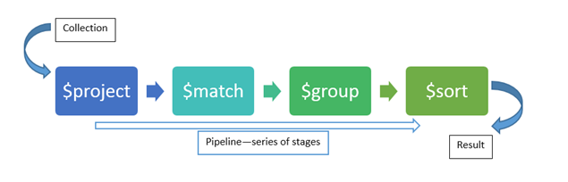

# Consultas en Mongo DB

Tres tipos de consultas
- con expresiones regulares
- con expresiones aritméticas
- con objetos anidados

## RegEx

Una expresión regular es una cadena que describe un patrón de caracteres.

Sintáxis de una RegEx: /pattern/modifiers

| Modifier | Description |
|----------|-------------|
|g         | Permite hacer una búsqeda global
|i         | Permite hacer una búsqueda case insensitive
|m         | Permite hacer búsquedas en varias líneas

E.g.

```json
{name: "/Pepito/"}
{name: "/Pepito/i"}
{address: "/06%/"} // la línea finaliza en 06
{address: "/^06/"} // la línea comienza en 06
{address: "/.*06.*/"} // Que incluyan 06 en alguna parte .* puede haber cualquier cadena
```

## Consultas a objetos anidados  y arreglos anidados

Usando la notación punto, es necesario usar las commillas doblres de otra forma Mongo no búscara ese campo con notación punto.

```json
{ "person.telephone" = 1}
```

Para los arreglos podemos acceder a ellos mediante su indice o utilizando la función $in, que nos permiten filtran medianto los elementos de un array, por ejemplo las amenidades que inluyan "Kitchen"

```json
{amenities:{$in: ["Kitchen"]}}
```

E.g. podemos obtener:
- la lista de todas las publicaciones con un costo menor a 100,
- que se encuentren en España, 
- con una valoración de 50 o más puntos, 
- que cuenten con Internet o Wifi y que tegan Elevador.

```js
FILTER {costo:{$lt:100}, pais: "España", calificacion:{$gte:50}, amenidades:
{
  "$or":[
    {
      $in: ["internet", "wifi"]
    },
    {
      $in:["Elevador"]
    },
  ]
}
```

**Reto 2**

Un filtro que permita obtener 
- todas las publicaciones que tengan 50 o más comentarios, 
- que la valoración sea mayor o igual a 80, 
- que cuenten con conexión a Internet vía cable y 
- estén ubicada en Brazil.

```json
FILTER {comentarios:{$gte:50}, valoracion:{$gte:80}, amenidadews:{$in:["Ethernet"]},country:"Brazil"}
```
## Agregaciones

Las agregaciones sirven para realizar subconsultas. Las agregaciones son divididas por capas, cada capa pued ver las columnas de la capa anterior yy en cada paso se genera una nueva colección con los resutlados correspondientes.

Con capas podemos agregar nuevos campos, proyectar campos, ordenar colecciones, filtrar información, realizar agrupamientos. Las capas son una tubería(pipeline) que inicia en la colección original y después de ciertos procesamientos genera un resultado final



