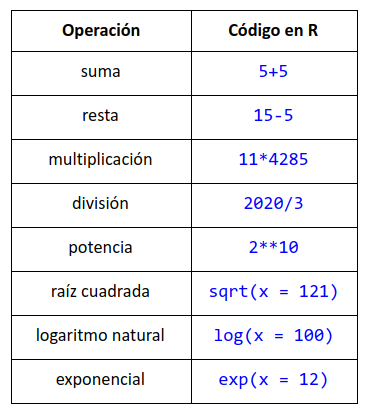

# Introducción 

## Instalación

[R](https://cran.itam.mx/index.html)

[RStudio](https://rstudio.com/)


**R** es un lenguage de programación que tiene un enfoque de análisis estadístico

**R** es el lenguaje de programación y **R Studio** es el IDE

```r
print('Hola mundo en R')
```

Se pueden usar comillas dobles o simples

### R como calculadora



### Representación de numeros en R

Cuando se escriben números R los cambia a notación e

```r
10000000
[1] 1e+07
0.0000001
[1] 1e-07
```
1e+07 es igual a 1 x 10 a la 7

La notación e dice que cualquier número a puede ser expresado como **aey** que representa **a x 10y**

R tiene un límite de representación de números

### Orden de Operaciones

**+** 
  - Paréntesis
  - Exponentes
  - Multiplicación
  - División
  - Suma 
  - Resta

**-**

## Tipos de datos

- Numeric:
  - Integer(enteros) : L
  - Float(decimales)

- Complex: Números complejos con números imagianrios 1+4i...
- Logical: True or False
- Character: Strings


Identificar el tipo de dato:
```r
is.integer()
is.numeric()
is.logical()
is.character()
```

```r
class()
typeof()
```


Cambiar el tipo de dato:
```r
as.integer()
as.numeric()
as.logical()
as.character()
```

## Estructuras

Las estructuras son la forma en que organizamos los diferentes tipos de datos que hay

- **Vectores**: Estos son valores que sólo están en una dimensión (Esto quiere decir que están en una línea y no forman tablas con columnas ni filas). Normalmente se crean con la función c(). Esto hace que lo que esté dentro del paréntesis se convierta en un vector. Con los vectores se pueden hacer operaciones aritméticas y ÚNICAMENTE pueden ser del mismo tipo de dato.

```r
x <- c(24, 55,66,84)
```

-**Listas**:Las listas son igual a los vectores, pero lo que difiere de ellos es que estas sí pueden guardar diferentes tipos de datos. Estas se pueden crear usando la función list().

```r
x <- list(24, “55”,2.5, c(2,3))
```

-**Matrix**:Las matrices son datos estructurados en dos dimensiones: columnas y filas. Estas se pueden crear con la función matrix() y al igual que los vectores, únicamente pueden guardar 1 mismo tipo de dato.

```r
x <- matrix(1 : 9, byrow = TRUE, nrow = 3) 
```

Para conocer los argumentos de la función matrix()
```r
?matrix
```

-**Data Frames** son datos organizados en dos dimensiones: columnas y filas. Son igual que las matrices pero pueden guardar diferentes tipos de datos.

-**Funciones** convierten una entrada o dato, lo procesan y arrojan un resultado

## Paquetes

Se instala el paquete que se necesita, con hacerlo una vez es suficiente

```r
install.packages(“ggplot2”)
```

Se manda llamar en el archivo que lo vaya a ocupar
```r
library(ggplot2)
```

## Funciones

Para poder crear una función, hay qeu conocer su estructura:
- Nombre de la función
- Argumentos
- Cuerpo
- Resultado

```r
saludo <- function(nombre){ mensaje <- paste(“Hola”, nombre) return(mensaje)
}
saludo(“Ana”) 
saludo(“Pablo”)
```
## class

Instructor: Erick Coronado Juárez

Tarea: ¿Cuál es la diferencia entre class() y typeof()?

Reciclado de variables en operaciones con vectores y matrices

[x] Revisar rbind() para mezclar matrices

[x] Llamar por nombre a la columna

[x] Actualizar nombres de los archivos